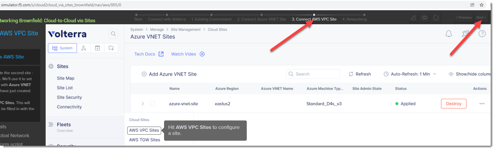

Distributed Cloud AWS VPC Site
=====================

In additional to using the Distributed Cloud WAF from an F5 Regional Edge / PoP location
you can also deploy a "Cloud Mesh" node that enables you to access networks that
are not directly connected to the Internet and/or enforce WAF policies locally 
within the local network.

When we deploy Cloud Mesh outside of a Regional Edge we refer to these locations as
"Customer Edge".  In the following exercise we will review what the process is to
deploy a Customer Edge.  In our existing lab environment we have already deployed 
a shared Distributed Cloud AWS VPC Site.

Once a Distributed Cloud node has been deployed into a Customer Edge it help provide two
additional topologies for Volterra WAF protection.

#. Enabling Distributed Cloud to protect a resource from the Regional Edge (additional DDoS protection)
   that is not directly attached to the internet.
#. Allow Distributed Cloud to provide WAF protection for "internal" and/or "local"

Exercise 1: Introduction to Distributed Cloud AWS VPC Site
~~~~~~~~~~~~~~~~~~~~~~~~~~~~~~~~~~~~~~~~~~~~~~~~~

#. Start in Distributed Cloud Console and find the "AWS VPC Sites" menu item. 

   From the top left "Select service" and look under "All Services"->"Cloud and Edge Sites"

   Click on "AWS VPC Sites"

   .. image:: ../_static/menu-cloud-edge-sites.png

#. Find the "student-awsnet" site

   In this lab environment we have already deployed a shared AWS VPC Site that we will 
   use in this lab.  Click on the "student-awsnet"

   You will be able to observe several metrics about the health of the site.

   In this deployment a Cloud Mesh node has been deployed into an existing VPC in our
   shared AWS lab environment.

#. Browse back to "AWS VPC Sites" 

   Cloud Mesh nodes can also be deployed into VMWare and KVM environments as well through
   a site registration process. 

Exercise 2 (Optional): F5 Distributed Cloud Simulator
~~~~~~~~~~~~~~~~~~~~~~~~~~~~~~~~~~~~~~~~~~~~

During this lab we will not deploy a new AWS VPC Site.  If you would like to learn 
more about deploying an AWS VPC Site via Volterra you may want to try using the 
following F5 Volterra Simulator:

-https://simulator.f5.com/s/cloud2cloud_via_sites_brownfield

You can emulate the steps that were used to create the Volterra VPC Site in the lab environment by starting
with the "3. Connect AWS VPC Site" https://simulator.f5.com/s/cloud2cloud_via_sites_brownfield/nav/aws/005/0

Clicking on the "Next" button in the top right will allow you to see similar steps that were used to create the site.

